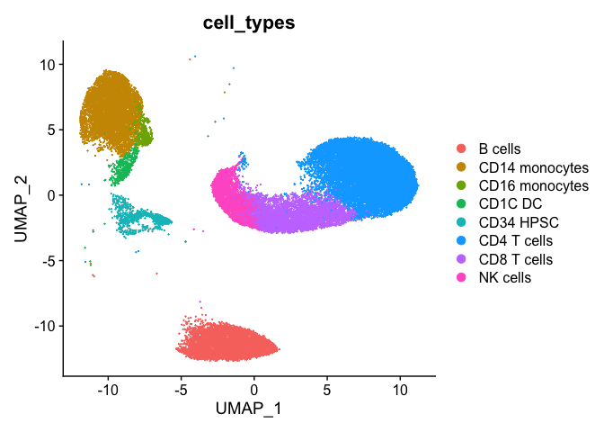
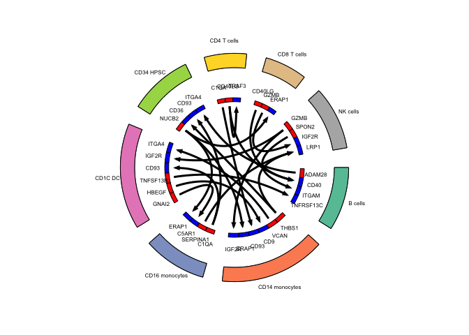

# celltalker

## Welcome to the celltalker package website
- Check out the core functionality of the package in the vignette under "Get Started"!
- If you have groups of samples with replicates in each group (e.g. disease vs control) and want to identify interactions that are statistically different between groups, check out the "Identify significantly different interactions across groups with replicate samples" vignette under Articles.
